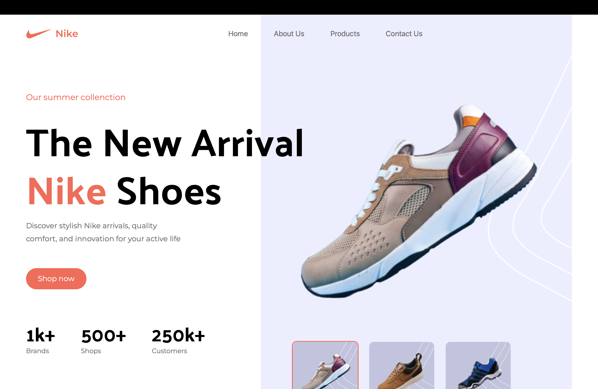

### Nike Landing Page for Shoes

Welcome to the Nike landing page for shoes, where you can discover the latest styles and trends in footwear. With a focus on innovation and design, our platform offers a curated selection of shoes for every occasion. Explore our collection and find the perfect pair to elevate your style.

---

#### About
The Nike landing page for shoes is developed and maintained by [Md Musfikur Rahman](https://musfikur.com). We are committed to providing athletes and individuals with high-quality footwear that meets their performance and style needs. Join us on this journey to elevate your game and step into greatness with Nike.

---

#### Technologies Used

- **React**: A JavaScript library for building user interfaces, providing a seamless and interactive browsing experience.
- **Vite**: A fast and lightweight build tool for modern web development, enabling rapid development and hot module replacement.
- **Tailwind CSS**: A utility-first CSS framework for building responsive and customizable user interfaces with ease, allowing for consistent styling and layout across all pages.

---

#### Mission Statement

At Nike, our mission is to inspire athletes and individuals around the world to reach their full potential through the power of sport and innovation. With our landing page for shoes, we aim to provide a seamless shopping experience that showcases our commitment to quality, performance, and style. Whether you're hitting the track or the streets, Nike has the perfect shoe to help you achieve your goals.

---

#### Deployment

The Nike landing page for shoes is deployed on [deployment platform], ensuring reliable hosting and accessibility. The deployment process is automated and streamlined, allowing for quick updates and optimizations.

**Live Link**: [Nike Landing Page for Shoes Demo](https://nikes-shoes.vercel.app)

To deploy the Nike landing page for shoes:
1. Clone the repository from GitHub.
2. Install dependencies using npm or yarn.
3. Configure environment variables as necessary.
4. Connect the project to the deployment platform and deploy using the provided tools or scripts.
5. Monitor the deployment status and access the live application URL.

---

#### Contributing

Contributions to the Nike landing page for shoes are welcome! Whether you want to suggest new features, report bugs, or submit code improvements, please follow these guidelines:
- Fork the repository and create a new branch for your changes.
- Commit your changes with descriptive messages.
- Open a pull request, explaining the purpose and impact of your changes.
- Participate in discussions and address feedback to ensure the quality of contributions.

---

#### Contact

For inquiries, feedback, or support, please contact the project maintainer(s) at [contact@musfikur.com](mailto:contact@musfikur.com).

---

**Screenshot**:

